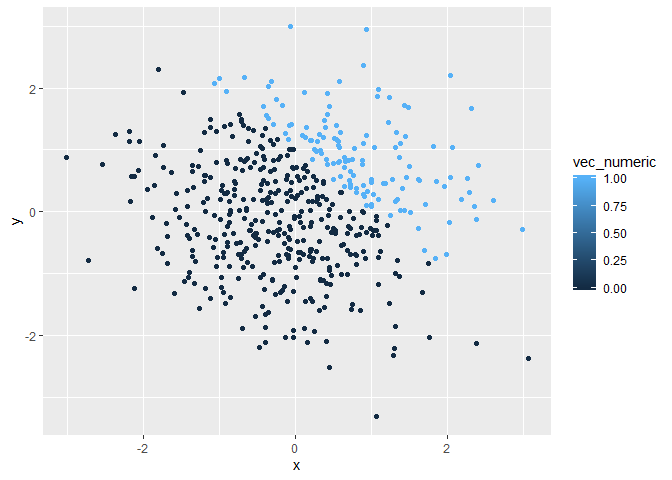
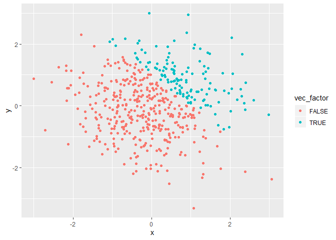

p8105\_hw1\_yq2251
================
TritonD
9/13/2019

\#\#Question 1 \#\# create data
    frame

``` r
library(tidyverse)
```

    ## -- Attaching packages ----------------------------------------- tidyverse 1.2.1 --

    ## v ggplot2 3.2.1     v purrr   0.3.2
    ## v tibble  2.1.3     v dplyr   0.8.3
    ## v tidyr   0.8.3     v stringr 1.4.0
    ## v readr   1.3.1     v forcats 0.4.0

    ## -- Conflicts -------------------------------------------- tidyverse_conflicts() --
    ## x dplyr::filter() masks stats::filter()
    ## x dplyr::lag()    masks stats::lag()

``` r
hw1_df=tibble(
   vec_numeric=rnorm(n=8, mean=0, sd=1),
   vec_logical=c(vec_numeric>0),
   vec_char=character(length=8),
   vec_factor=factor(vec_char, levels = c("a", "b", "c"))
)
```

\#take mean of each
    variable

``` r
mean(pull(hw1_df, vec_numeric))
```

    ## [1] 0.3390853

``` r
mean(pull(hw1_df, vec_logical))
```

    ## [1] 0.875

``` r
mean(pull(hw1_df, vec_char))
```

    ## Warning in mean.default(pull(hw1_df, vec_char)): argument is not numeric or
    ## logical: returning NA

    ## [1] NA

``` r
mean(pull(hw1_df, vec_factor))
```

    ## Warning in mean.default(pull(hw1_df, vec_factor)): argument is not numeric
    ## or logical: returning NA

    ## [1] NA

\#the numeric and logical vectors have the mean, the others don’t.

\#\#write a chunk to convert logical, character, and factor variables
into numeric

``` r
as.numeric(pull(hw1_df, vec_logical))
```

    ## [1] 1 1 1 1 1 1 0 1

``` r
as.numeric(pull(hw1_df, vec_char))
```

    ## [1] NA NA NA NA NA NA NA NA

``` r
as.numeric(pull(hw1_df, vec_factor))
```

    ## [1] NA NA NA NA NA NA NA NA

\#According to the output,logical vector can be converted to numeric
vector with “true” or “false” replaced by “1” and “0”. \#Both character
and factor vectors failed to be converted to numeric vector with a “NA”
result. \#Mean function is specifically for numeric values, thie
explained why only numeric and logical vectors have the mean

\#write a second chunk to convert logical vector with extra sample
calculation

``` r
pull(hw1_df, vec_numeric)*as.numeric(pull(hw1_df, vec_logical))
```

    ## [1] 0.73943265 0.53962249 0.07277471 0.32544040 0.84184352 0.90594389
    ## [7] 0.00000000 0.59589694

``` r
pull(hw1_df, vec_numeric)*as.factor(pull(hw1_df, vec_logical))
```

    ## Warning in Ops.factor(pull(hw1_df, vec_numeric), as.factor(pull(hw1_df, :
    ## '*' not meaningful for factors

    ## [1] NA NA NA NA NA NA NA NA

``` r
as.numeric(as.factor(pull(hw1_df, vec_logical)))*pull(hw1_df, vec_numeric)
```

    ## [1]  1.4788653  1.0792450  0.1455494  0.6508808  1.6836870  1.8118878
    ## [7] -1.3082721  1.1917939

\#\#Question 2 \#\# create data frame

``` r
hw1_df2=tibble(
   x=rnorm(n=500, mean=0, sd=1),
   y=rnorm(n=500, mean=0, sd=1),
   vec_logical=x+y>1,
   vec_numeric=as.numeric(vec_logical),
   vec_factor=as.factor(vec_logical)
)
```

\#add inline R code to explain the dataset and results The number of
rows in dataset is 500 rows and 5 columns. The mean of x is 0.0424455.
The median of x is 0.0082075. The standard deviation of x is 0.9827205.

The proportion of cases for which x + y \> 1 is 0.252.

\#draw scatterplot y versus x using logical variables

``` r
ggplot(hw1_df2,aes(x=x,y=y,color=vec_logical))+geom_point()
```

<!-- -->

\#save the first scatterplot in the project directory

``` r
ggsave("Rplot.png",width = 20, height = 20, units = "cm")
```

\#draw scatterplot y versus x using numeric variables

``` r
ggplot(hw1_df2,aes(x=x,y=y,color=vec_numeric))+geom_point()
```

<!-- -->

\#draw scatterplot y versus x using factor variables

``` r
ggplot(hw1_df2,aes(x=x,y=y,color=vec_factor))+geom_point()
```

<!-- -->
